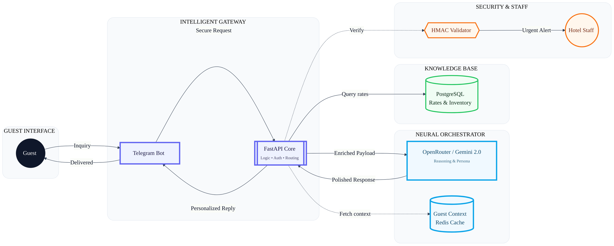

## Retell Custom LLM

**Handler:** `WebSocket /llm-websocket/{call_id}` in `app/main.py`

**Where prompts live**
- `SYSTEM_PROMPT` constant in `app/main.py`
- Guardrails enforced in the websocket handler before calling the model

**Guardrails**
- If user message is empty/unclear, respond with a clarifying question
- Prevent repeating the last assistant message
- Dedupe repeated user utterances within 10 seconds

**Debug marker (temporary)**
- To verify Retell is using our Custom LLM, set `RETELL_DEBUG_MARKER=1` in Railway env vars and redeploy.
- When enabled, every response will be prefixed with `GRACE_WS_OK: `.
- Disable after verification by unsetting `RETELL_DEBUG_MARKER` or setting it to `0`.
